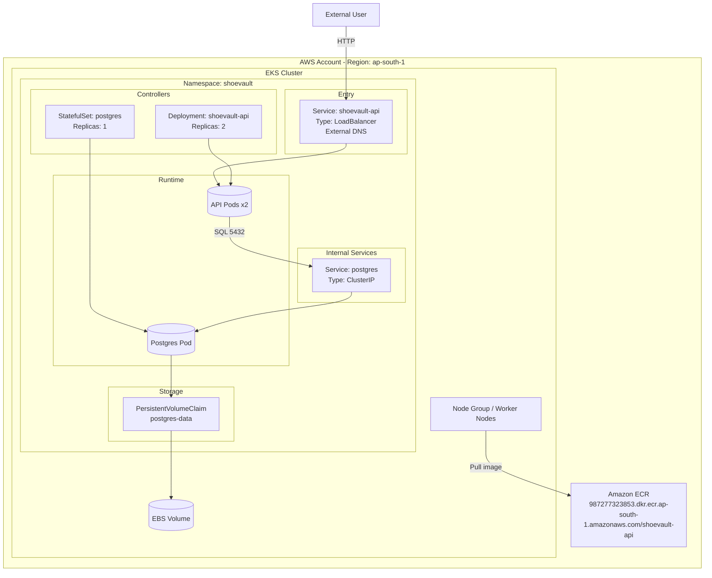
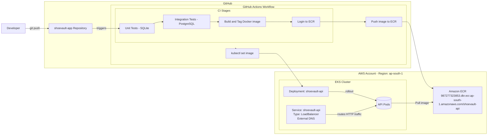

# ShoeVault – Cloud-Native DevOps Project

## 📌 Project Overview
ShoeVault is a cloud-native application designed and deployed using modern DevOps practices.  
The project demonstrates containerization, CI/CD automation, and Kubernetes-based deployment on AWS.

---

## 🏗 Architecture
## Architecture (Mermaid)

## CI/CD Workflow (Mermaid)

High-level flow:
- Flask-based application
- PostgreSQL database
- Docker containerization
- Amazon ECR for image storage
- Amazon EKS for orchestration
- CI pipeline for automated testing and image validation

---

## ⚙️ Tech Stack
- AWS (ECR, EKS)
- Docker
- Kubernetes
- GitHub Actions (CI)
- PostgreSQL
- Python (Flask)

---

## 🚀 Infrastructure & Deployment
- Container images built and pushed to Amazon ECR
- Application deployed to Amazon EKS
- Kubernetes manifests for deployments and services
- CI pipeline for automated tests and Docker image validation

---

## 📂 Project Repositories

Main application:
👉 https://github.com/YOUR_USERNAME/shoevault-app

Infrastructure:
👉 https://github.com/YOUR_USERNAME/shoevault-infra

Cluster resources:
👉 https://github.com/YOUR_USERNAME/shoevault-cluster-resources

---

## 📎 Full Source Code
All components are publicly available in the repositories above.
